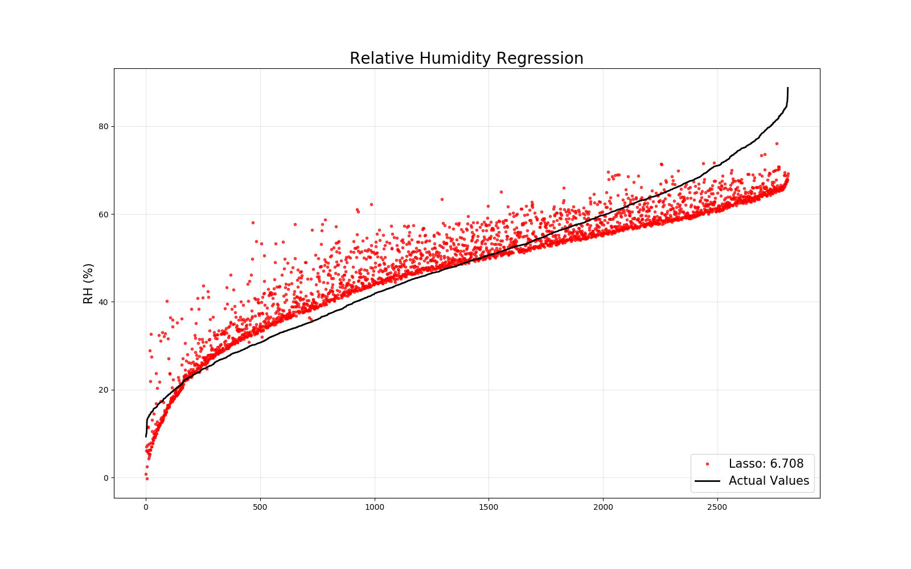
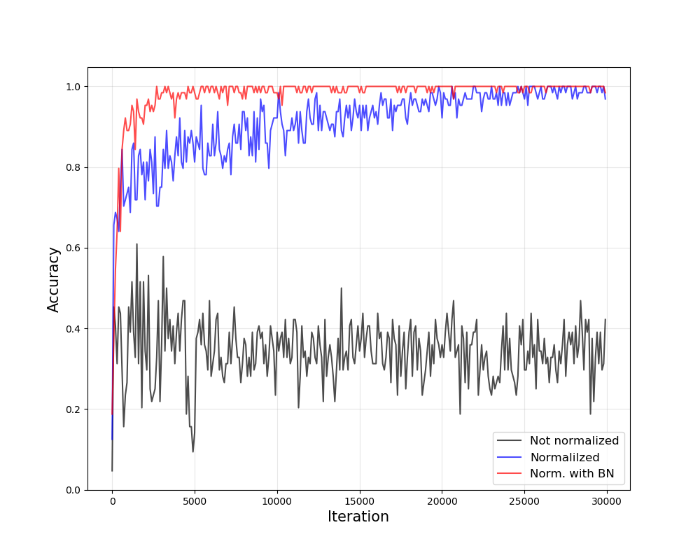
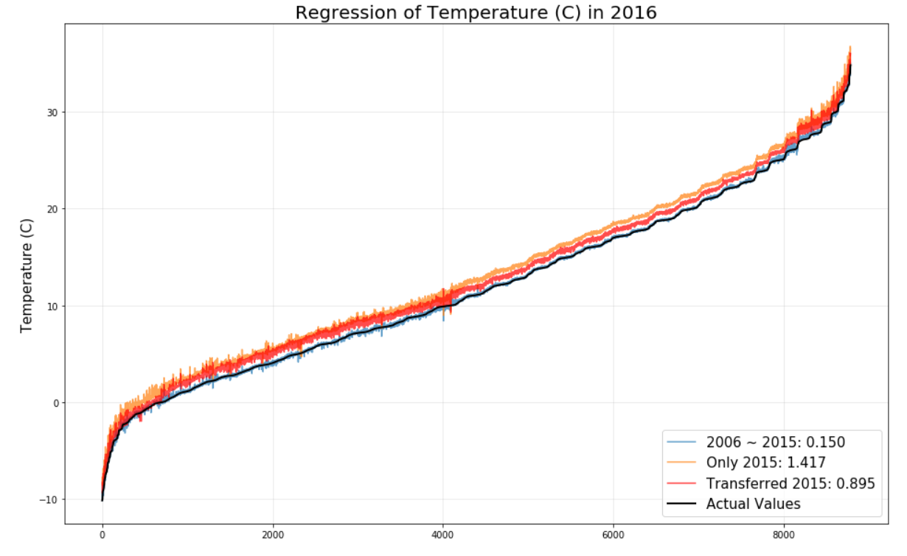

# 2020_SHI_Deep_Learning_Tutorial
2020.01.07. ~ 삼성중공업 딥러닝 5주 실습교육, 담당주차 연습문제 

## Relative Humidity Regression

### ML regressors using Sklearn 

## Steel Plate Defect Identification

### Input Scailing and Feature Normalization (Batch Normalization)

## Temperature Regression

### Transfer Learning using RH Regressor

