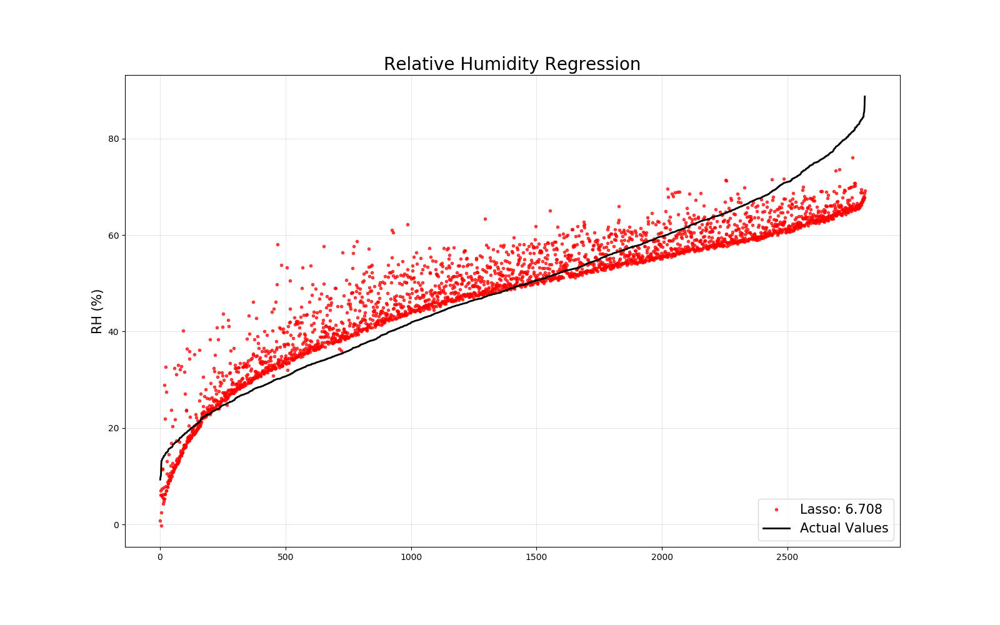
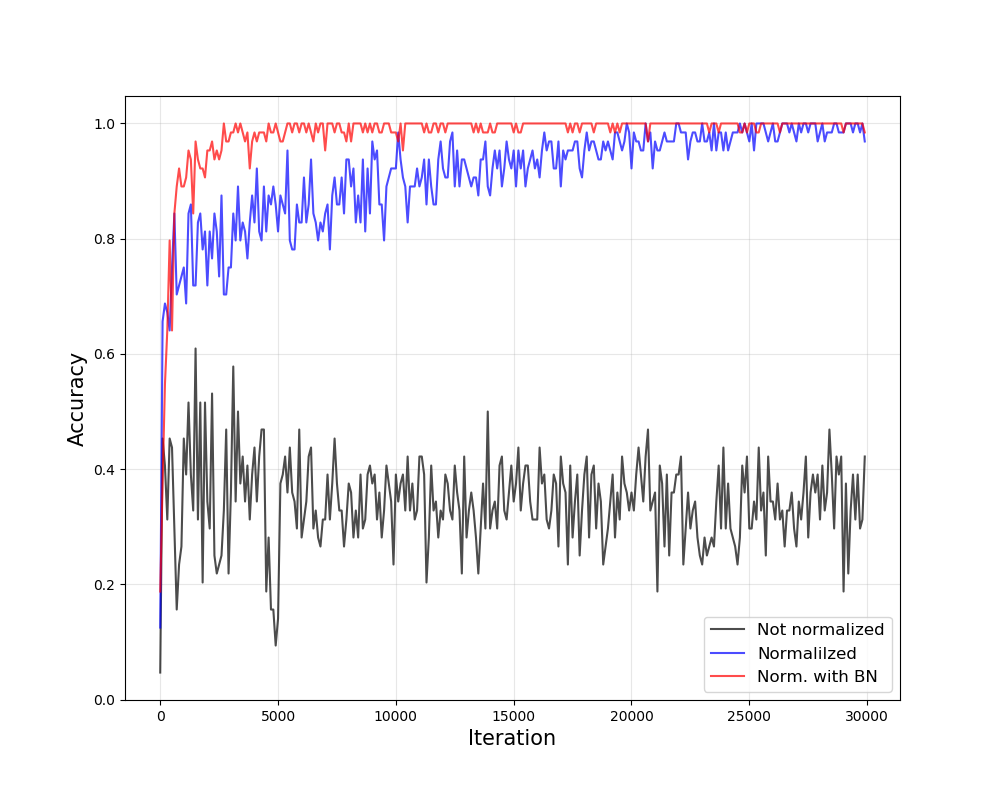
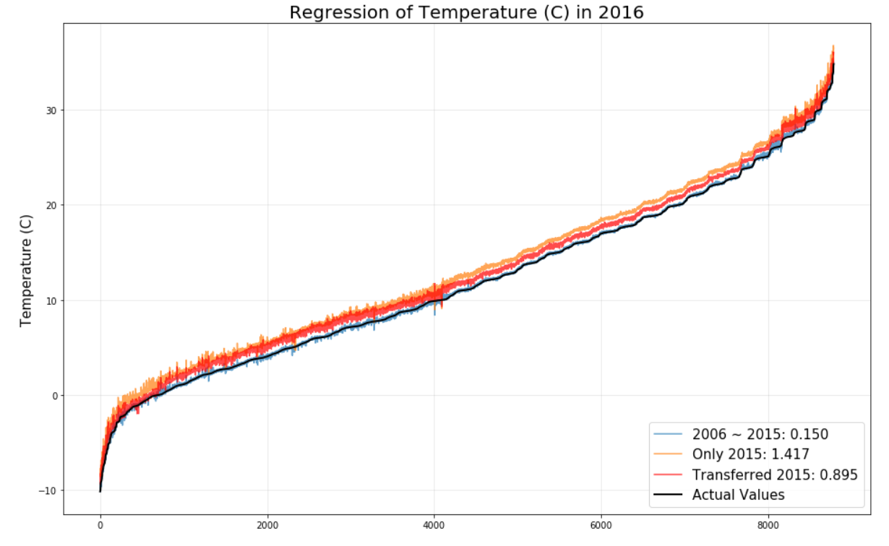

# 2020_SHI_Deep_Learning_Tutorial

## Relative Humidity Regression

### ML regressors using Sklearn 

## Steel Plate Defect Identification

### Input Scailing and Feature Normalization (Batch Normalization)

## Temperature Regression

### Transfer Learning using RH Regressor

